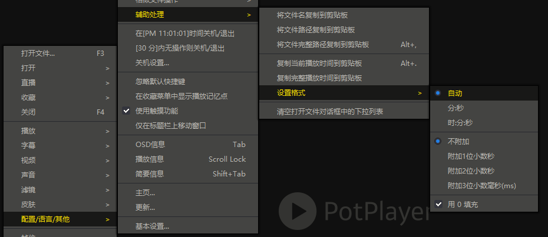

# 使用说明

## 1 前置准备

下载release中的压缩包


### 1.1 安装AutoHotKey


一路下一步，然后删掉


### 1.2 修改配置

1. 运行脚本文件：`markdown2potplayer.ahk`
2. 双击右下角的托盘图标


**修改1**：修改Potplayer的主程序路径，为你本机的路径

**修改2**：指定笔记软件的软件名称

- `说明`：只会按照从上至下的顺序，给1个笔记软件粘贴回链
- 例如：此处同时配置了obsidian和typora
  - 情况1：在obsidian和typora同时打开的情况下，只会粘贴到obsidian中
  - 情况2：只有typora打开，则粘贴到typora中


## 2 使用

1. 打开`markdown2potplayer`
1. 打开obsidian
1. 打开potplayer

3. 在笔记软件、或者potplayer`窗口激活`的状态下，<b style="color:red">按热键Alt+G(默认)</b>，即可自动粘贴**视频的回链**到obsidian中
4. 在笔记软件、或者potplayer`窗口激活`的状态下，<b style="color:red">按热键Ctrl+Alt+G(默认)</b>，即可自动粘贴**图片+视频的回链**到obsidian中

# 高级设置

## 模板的修改


此处是**粘贴模板**的修改，一共有`4`个模板项。


**注意**：这5项，不是哪个位置都可以用

- 回链的名称：只能用`{name}`、`{time}`

- 回链模板：只能用`{title}`
- 视频回链模板：只能用`{image}`、`{title}`


逐一说明：

- `{name}`：代表视频的文件名称，也就是`[`视频**名称**`]`
- `{time}`：代表当前播放视频的时间，也就是`[`视频**时间**`]`
- `{title}`**代表整个markdown格式的链接**，例如`[百度](https://www.baidu.com)`也就是说，此处是markdown格式的potplayer回链
- `{image}`代表**图片粘贴的位置**


### 示例1

我想要`Alt+G`是这个效果


此处应该这么填

1. 先确定**回链中的`[]`内的名称**

```
{name} | {time}
```

2. 再确定**整个模板的数据**

````
```Video
title: {title}
```
````

最终效果


### 示例2

我想要`Ctrl+Alt+G`是这个效果


视频回链模板此处应该这么填

````ini
```video
title:{title}
image:{image}
```
````


## 播放B站视频

1. Potplayer需要提前安装插件：[chen310/BilibiliPotPlayer](https://github.com/chen310/BilibiliPotPlayer)

2. 按照插件的使用文档，在potplayer中播放视频
3. 使用快捷键打时间戳即可


## 调整时间的格式

这里




## 开机启动

参考：https://blog.csdn.net/liuyukuan/article/details/121526961

1. 按 Win + E ，打开 资源管理器

2. 在顶部的地址栏中，输入如下地址，回车进入这个文件夹

`C:%homepath%\AppData\Roaming\Microsoft\Windows\Start Menu\Programs\Startup`也就是这个路径`C:\Users\你电脑的用户名\AppData\Roaming\Microsoft\Windows\Start Menu\Programs\Startup`

3. 将脚本`potplayer2note.ahk`，在这个文件夹中，`创建快捷方式`


【去掉开机自启】：把脚本的快捷方式删了就ok

## 视频文件的后缀名

控制名称中是否包含文件名的后缀


## 地址是否编码

控制视频地址，是否使用编码

**关闭编码的效果**


注意

- 目前发现的bug：关闭编码之后，假如视频的路径中有`空格`，在obsidian的预览模式，回链`不会渲染为链接`，所以即使关闭编码也会将空格进行编码。如果不想空格也被编码，可以去掉文件中的空格 或 使用`-`、`_`等替代空格
- 可能还有其他符号也有类似的问题，但暂未发现


## 自定义快捷键

修改源码，首先参考官方文档，如何自定义快捷键[热键 - 定义 & 使用 | AutoHotkey v2](https://wyagd001.github.io/v2/docs/Hotkeys.htm)

1. 使用文本编辑器，修改源码。因为使用的编码是UTF-8，windows默认的记事本，会有些许兼容问题，推荐使用文本编辑器


## 自定义跳转协议

适合自定义协议的人使用【谨慎】

修改的是此处

